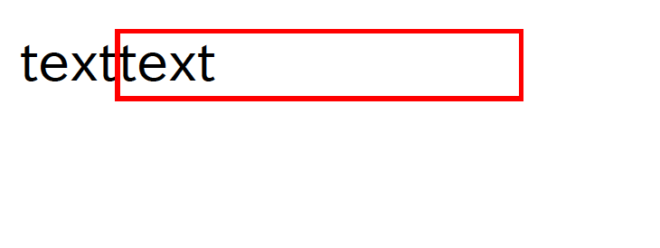

# go-pdf

CLI tools to generate PDF from JSON

## Feature

* Liner layout
* Style template
* Auto line break
* Auto page break
* Header / Body / Footer
* Image resizing
* Text break
* Text wrap

## Specification

* 一つの `liner_layout` に対して `elements` と `liner_layouts` を含めることはできない。
* PDF生成に利用しているライブラリの関係上、テキスト色を黒色以外から黒色テキストに戻す場合に `rgb(0,0,0)` では正しく判定されないので、黒色テキストは `rgb(1,1,1)` を使う。

## Fonts

https://github.com/minoryorg/Noto-Sans-CJK-JP

## Samples

* [Report](./samples/sample-report1/output.pdf)

[See Other](./samples/)

## How to use

### basic

```bash
go-pdf --in layout.json --out output.pdf --ttf fonts/TakaoPGothic.ttf

```

### show help

```bash
go-pdf --help
```

## Examples

```json
{
  "$schema": "https://raw.githubusercontent.com/apple-x-co/go-pdf/master/json_schema/document.json",
  "width": 595,
  "height": 842,
  "pages": [
    {
      "liner_layout": {
        "orientation": "horizontal",
        "elements": [
          {
            "type": "text",
            "attributes": {
              "text": "text"
            }
          },
          {
            "type": "text",
            "attributes": {
              "text": "text",
              "size": {
                "width": 100
              },
              "border": {
                "width": 1,
                "color": {
                  "r": 255,
                  "g": 0,
                  "b": 0
                }
              }
            }
          }
        ]
      }
    }
  ]
}
```

 
